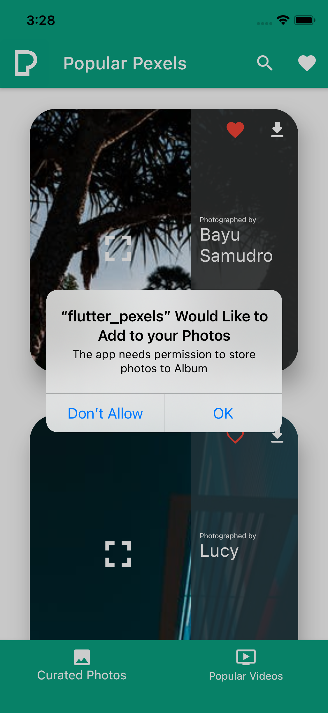
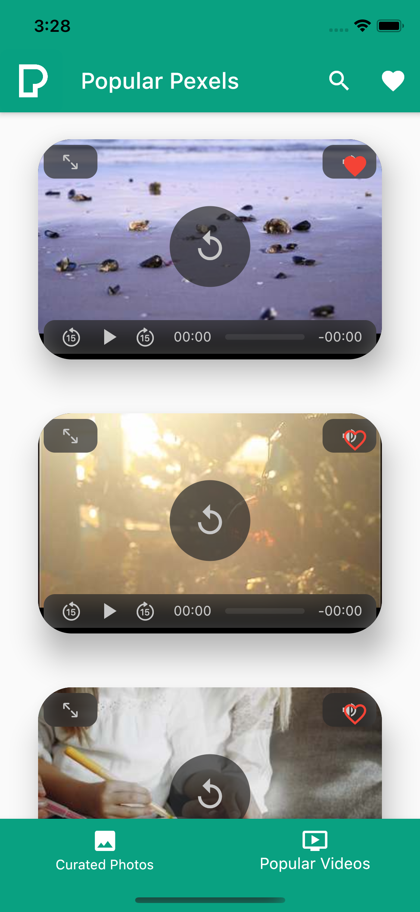
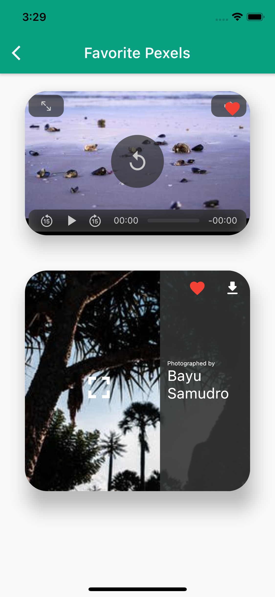

# Pexels

Pexels is a Flutter application built for Android and iOS that uses the Pexels Image/Video API and displays a list of curated images and popular videos. It has the following main features.

- Users can view photos and videos in an infinitely scrolling list.
- Users see a loading animation while the API requests are in flight.
- Users can find out the photographer's info for each image.
- The UI that displays the Photos displays colors according to the colors in the image. The most prominent colors in the image is used as the background color for the text. I have written an extension to convert Hex strings to Dart Colors.
- Users can view curated images and videos in high definition.
- Users can zoom and pan into the images when tapped, this displays the image in the largest available resolution.
- Users can also download images to their phone's Gallery or Photo Album.
- Users can add images and videos to their favorites and can have a look at the favorites anytime later.
- Users can also search images and videos using keywords.

## Screenshots

|  |  |  |
|----------------------------------|----------------------------------|----------------------------------|
|  |  |  |
|  |  |  |

## How to Run

Download or clone the project locally. Then run the following commands in order.

```bash
flutter pub get
flutter run
```
You need to have the Flutter SDK setup on the development machine to test or build this project.

## License
[MIT](https://choosealicense.com/licenses/mit/)