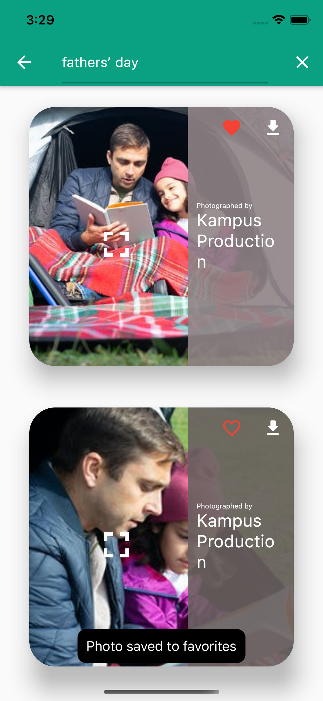

# Pexels

Pexels is a Flutter application built for Android and iOS that uses the Pexels Image/Video API and displays a list of curated images and popular videos. It has the following main features.

- Users can find out the photographer's info for each image.
- Users can view curated images and videos in high definition.
- Users can zoom and pan into the images when tapped, this displays the image in the largest available resolution.
- Users can also download images to their phone's Gallery or Photo Album.
- Users can add images and videos to their favorites and can have a look at the favorites anytime later.
- Users can also search images and videos using keywords.

## Screenshots

 |  | 
 |  | 

Use the package manager [pip](https://pip.pypa.io/en/stable/) to install foobar.

```bash
pip install foobar
```

## Usage

```python
import foobar

foobar.pluralize('word') # returns 'words'
foobar.pluralize('goose') # returns 'geese'
foobar.singularize('phenomena') # returns 'phenomenon'
```

## Contributing
Pull requests are welcome. For major changes, please open an issue first to discuss what you would like to change.

Please make sure to update tests as appropriate.

## License
[MIT](https://choosealicense.com/licenses/mit/)