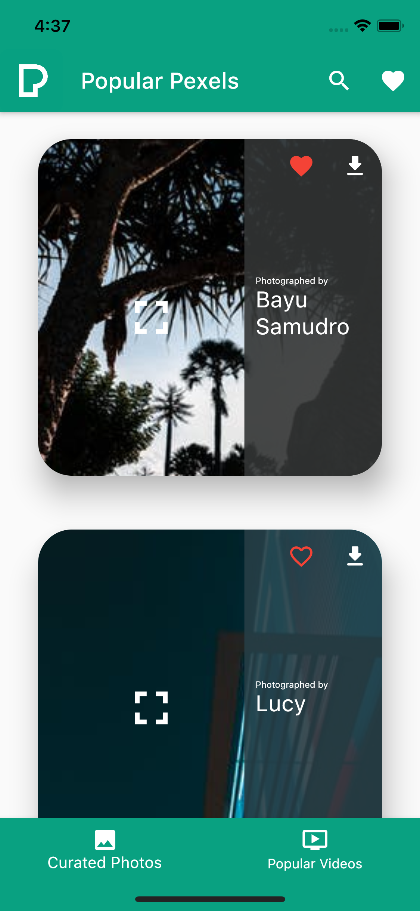
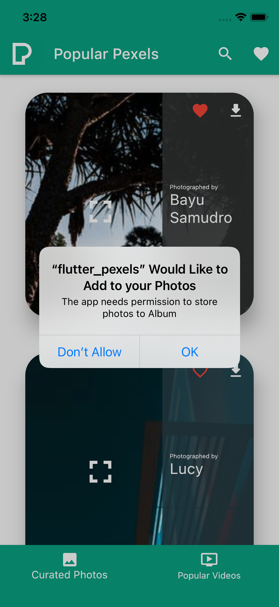
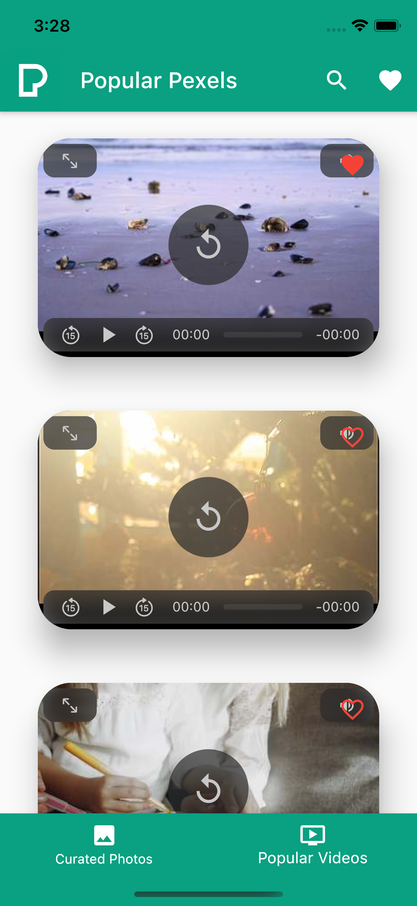
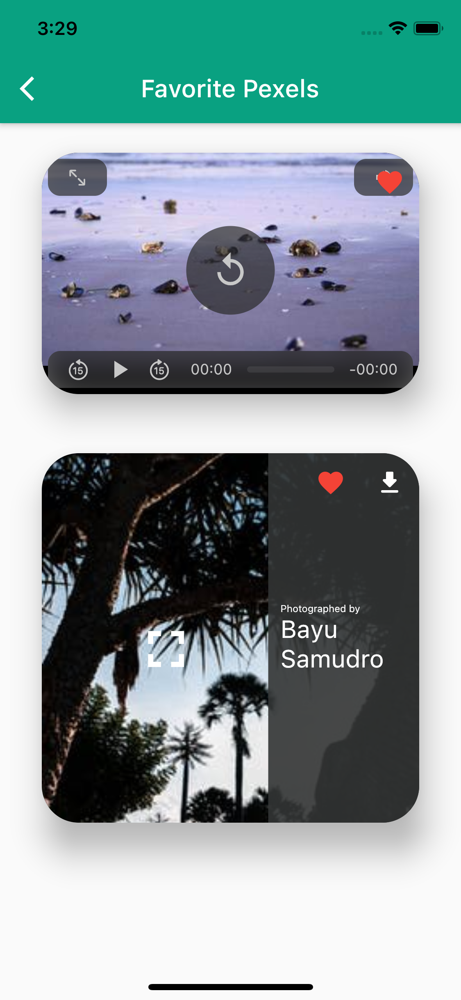
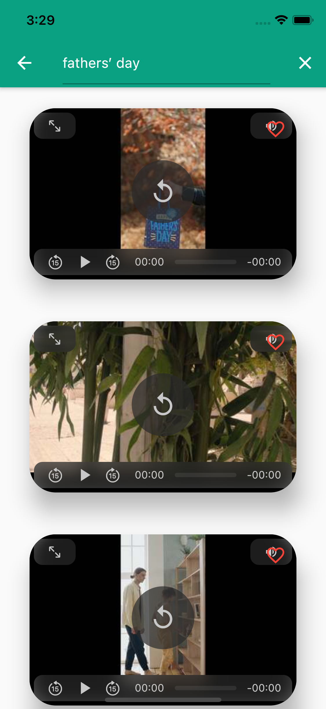
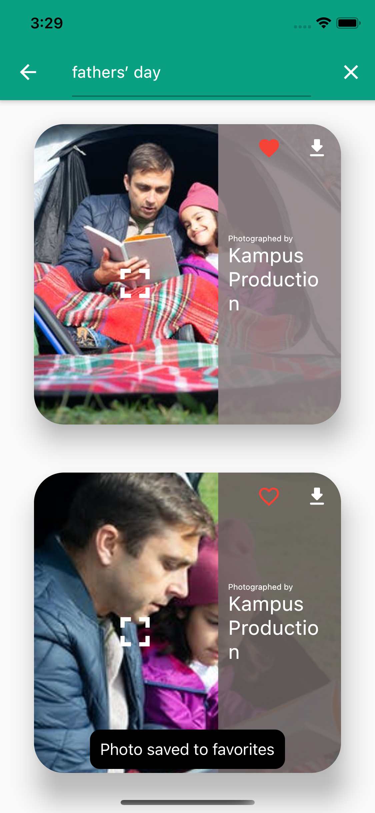

# Next Features

Pexels is simple app as of now with some powerful features. Here is a list of features I imagine that can make the app even more engaging.

- We can implement user management, this will allow users a more personalized and engaging experience.
- Since the Pexels API (as of now) does not allow users to create their own collections, we can allow users to create and store collections locally or on a cloud location like Firebase's Cloud Firestore.
- A feature to share the pictures and videos on Instagram and other social platforms would be so much fun.
- Some collections (of photos and videos) displayed on the home screen of the app. This will require some sort of persistence cloud storage or a remote database on a server.

## Screenshots

|  |  |  |
|----------------------------------|----------------------------------|----------------------------------|
|  |  |  |
|  |  |  |

## How to Run

Download or clone the project locally. Then run the following commands in order.

```bash
flutter pub get
flutter run
```
You need to have the Flutter SDK setup on the development machine to test or build this project.

## License
[MIT](https://choosealicense.com/licenses/mit/)